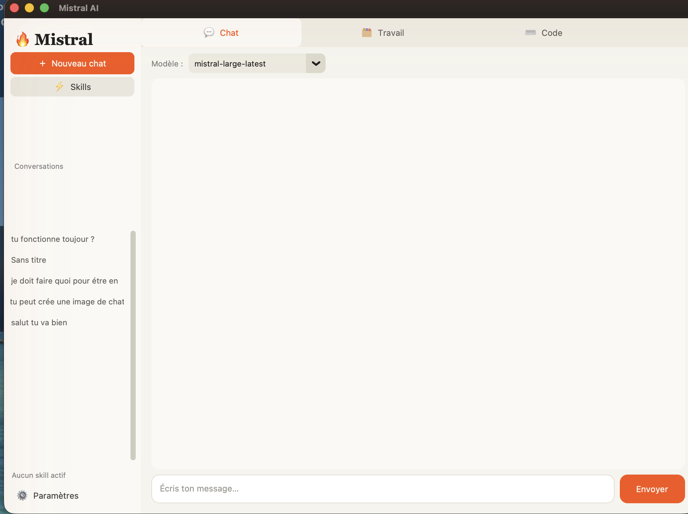
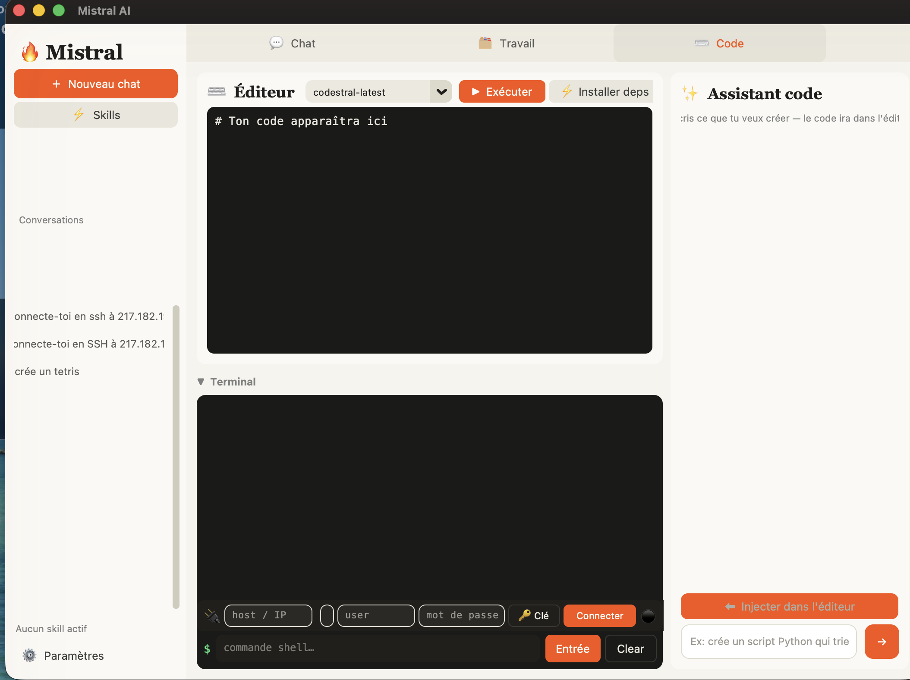

# Mistral AI Client

Interface desktop Python pour interagir avec l'API Mistral AI. Application multi-onglets avec chat IA, gestion de fichiers, terminal SSH intégré et bibliothèque de skills personnalisables.

Thème **orange Mistral** sur base éditoriale claire (parchemin/ivoire), titres serif, éditeur et terminal en mode sombre.

## Aperçu

| Chat | Code |
|------|------|
|  |  |

## Fonctionnalités

- **Chat IA** — conversations avec les modèles Mistral, historique sauvegardé, détection automatique des skills JSON générés par l'IA
- **Skills** — bibliothèque de personnalités IA (Assistant, Dev, Rédacteur, Traducteur, Analyste, Coach…) entièrement personnalisables
- **SSH intégré** — connexion SSH depuis les onglets Chat et Travail, support des clés chiffrées (passphrase), sélection de clé via explorateur de fichiers
- **SSH auto** — tape `connecte-toi en SSH à user@host` dans le chat et la connexion se fait automatiquement
- **Onglet Travail** — instruction globale, ajout de fichiers/dossiers en contexte, sélection du modèle
- **Onglet Code** — éditeur + terminal SSH avec invite de commande interactive ; l'assistant écrit le code directement dans l'éditeur (injection automatique)
- **Projets** — chaque projet possède un fichier `instructions.md` relu automatiquement à chaque nouvelle conversation (Chat, Travail et Code) ; les conversations sont rangées par projet

## Prérequis

```bash
pip install customtkinter mistralai paramiko
```

## Lancement

```bash
python app.py
```

> Garde le fichier `lueurs_theme.json` à côté de `app.py` : il définit le thème de l'interface. Sans lui, l'app revient au thème par défaut.

Au premier lancement, entre ta clé API Mistral dans les paramètres (⚙️).

## Configuration

La config est stockée dans `~/.mistral-client/config.json` :
- Clé API Mistral
- Conversations sauvegardées dans `~/.mistral-client/conversations/`
- Skills dans `~/.mistral-client/skills/`
- Projets dans `~/.mistral-client/projects/<nom>/` (un `instructions.md` + un dossier `conversations/` par projet)

## Projets

Un projet regroupe un contexte d'instructions et ses propres conversations, comme les Projets de Claude.

- Sélecteur **Projet** dans la barre latérale (« Général » par défaut, ou « ＋ Nouveau projet… »).
- À la création, tu donnes un nom et des **instructions** : elles sont enregistrées dans `instructions.md` et **relues au début de chaque conversation** du projet (Chat, Travail, Code).
- Le bouton **✏️** permet de modifier les instructions, **renommer** ou **supprimer** le projet.
- Les conversations d'un projet sont isolées : la barre latérale n'affiche que celles du projet actif.

## Modèles supportés

| Modèle | Usage |
|--------|-------|
| mistral-large-latest | Chat général, raisonnement |
| codestral-latest | Génération de code |
| mistral-medium-latest | Traduction, rédaction |
| open-mistral-nemo | Rapide et économique |

## SSH

L'app supporte :
- Connexion par mot de passe
- Connexion par clé SSH (RSA, Ed25519, ECDSA, PEM)
- Clés chiffrées (dialog passphrase automatique)
- Connexion depuis le chat en langage naturel
